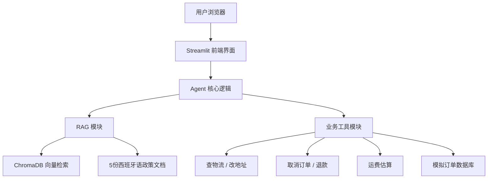

# 🌐 AutoService - 跨境电商智能客服（RAG + Agent）

> 一个基于 RAG（检索增强生成）与 Agent（智能体）的西班牙语跨境电商客服系统，支持订单查询、地址修改、取消订单、退款申请、运费估算及政策咨询，并已部署至 Streamlit Cloud 提供公开访问。

---

## 🎯 项目简介

**AutoService** 是一个面向西班牙语市场的跨境电商智能客服机器人。它结合了：

- **大语言模型（DeepSeek-V3）**：理解用户意图并生成自然语言回复。
- **RAG 知识库**：从企业文档中检索最新政策（退货、物流、隐私等），确保回答准确。
- **Agent 工具调用**：直接操作后台业务（查询物流、修改地址、取消订单、申请退款、估算运费）。

项目已实现完整的 MVP（最小可行产品），拥有 Web 聊天界面并部署上线，任何人均可通过公开链接体验。

---

## ✨ 核心功能

| 功能 | 描述 | 触发方式 |
|------|------|----------|
| 📦 订单物流查询 | 根据订单号查询物流状态、承运人、预计送达时间 | 用户询问订单状态 |
| 📝 修改配送地址 | 修改未发货订单的地址（需二次确认） | 用户要求改地址 |
| ❌ 取消订单 | 取消未发货订单（需二次确认） | 用户要求取消订单 |
| 💰 申请退款 | 为已送达订单申请退款，生成退款编号 | 用户投诉或申请退款 |
| 🌍 国际运费估算 | 根据目的地国家和重量估算运费 | 用户询问运费 |
| 📚 政策知识检索 | 从知识库检索物流、退货、退款、隐私等政策 | 用户咨询政策 |
| 💬 多轮对话 | 保持上下文，支持连续对话 | 自动 |
| 🛡️ 安全确认 | 敏感操作前需用户二次确认，防止误操作 | 自动 |
| ✅ 订单号校验 | 实时检查订单号格式（必须以 ESP 开头） | 输入订单号时 |

---

## 🏗️ 技术架构



---

## 📚 知识库内容

项目包含 5 份西班牙语政策文档（位于 `data/knowledge/`）：

| 文件名 | 内容概要 |
|--------|----------|
| `politicas_envio.txt` | 物流政策（发货时间、运费、快递公司） |
| `politicas_devolucion.txt` | 退货政策（条件、流程、退货地址） |
| `politicas_reembolso.txt` | 退款政策（方式、到账时间、部分退款） |
| `faq.txt` | 常见问题（查询、修改、取消、支付） |
| `politicas_privacidad.txt` | 隐私政策（数据收集、加密、用户权利） |

---

## 🛠️ 技术栈

| 层级 | 技术选型 |
|------|----------|
| 大模型 | DeepSeek-V3（OpenAI 兼容接口） |
| 向量嵌入 | Sentence Transformers (`paraphrase-multilingual-MiniLM-L12-v2`) |
| 向量检索 | ChromaDB |
| Agent 框架 | 自定义 Python 类 + Function Calling |
| 前端 | Streamlit |
| 部署 | Streamlit Cloud |
| 版本控制 | Git + GitHub |

---

## 📦 本地运行

### 环境要求

- Python 3.9 或更高版本
- Git

### 安装与启动

```bash
# 1. 克隆仓库
git clone https://github.com/Ljjjh66/autoservice-chatbot.git
cd autoservice-chatbot

# 2. 创建并激活虚拟环境
python -m venv venv

# Windows 用户执行：
venv\Scripts\activate

# macOS / Linux 用户执行：
source venv/bin/activate

# 3. 安装依赖
pip install -r requirements.txt

# 4. 设置环境变量（DeepSeek API Key）

# Windows PowerShell：
$env:DEEPSEEK_API_KEY="sk-你的密钥"

# macOS / Linux：
export DEEPSEEK_API_KEY="sk-你的密钥"

# 5. 启动应用
streamlit run main.py
```

浏览器访问 `http://localhost:8501` 即可开始使用。

---

## 🚀 部署到 Streamlit Cloud

1. 将项目代码推送到 GitHub 公开仓库。
2. 访问 `https://share.streamlit.io` 并使用 GitHub 账号登录。
3. 点击 **New app**，填写以下信息：
   - **Repository**：`Ljjjh66/autoservice-chatbot`
   - **Branch**：`main`
   - **Main file path**：`main.py`
4. 展开 **Advanced settings**，在 **Secrets** 中添加环境变量：
   ```
   DEEPSEEK_API_KEY = "sk-你的密钥"
   ```
5. 点击 **Deploy!** 按钮，等待构建完成。
6. 部署成功后，进入 **Settings → Sharing** 将应用权限设为 **"Anyone with the link"**，即可通过公开链接访问。

---

## 📂 项目结构

```
autoservice-chatbot/
├── main.py                 # Streamlit 前端界面
├── agent.py                # Agent 核心逻辑
├── tools.py                # 业务工具函数（含模拟订单数据库）
├── rag.py                  # RAG 知识库模块（文档加载、向量检索）
├── requirements.txt        # Python 依赖清单
├── runtime.txt             # 指定 Python 版本（3.11）
├── .gitignore              # Git 忽略规则
└── data/
    └── knowledge/          # 西班牙语知识库文档
        ├── politicas_envio.txt
        ├── politicas_devolucion.txt
        ├── politicas_reembolso.txt
        ├── faq.txt
        └── politicas_privacidad.txt
```

---

## 🧪 测试用例

在聊天界面输入以下西班牙语句子，验证各项功能：

| 测试输入 | 预期结果 |
|----------|----------|
| `¿Dónde está mi pedido ESP12345?` | 返回物流状态（运输中，DHL Express） |
| `Quiero cambiar la dirección de ESP12348 a Calle Nueva 123, Madrid` | 提示地址修改成功 |
| `Quiero cancelar mi pedido ESP12348` | 先请求确认，回复 `sí` 后取消订单 |
| `Quiero solicitar un reembolso para ESP12347, el producto llegó dañado` | 生成退款编号（RMA-XXXXXXXX） |
| `¿Cuánto cuesta enviar un paquete de 2kg a Alemania?` | 返回估算运费 27 欧元 |
| `¿Cuál es la política de devoluciones?` | 检索知识库，返回 30 天退货政策 |

---

## 🔮 未来扩展方向

- 增加多语言支持（英语、中文等）
- 接入真实订单数据库，替换模拟数据
- 添加人工客服转接机制
- 支持语音输入与播报
- 数据看板与客服统计功能

---

## 📝 开发笔记

项目开发过程中积累了详细的问题解决记录，包括：

- ChromaDB 兼容性问题及解决方案
- DeepSeek 模型伪函数调用的正则解析修复
- Streamlit Cloud 部署时的依赖冲突处理
- 敏感操作的二次确认安全机制

如需查阅完整笔记，请见项目 Wiki 或提交记录。

---

## 📋 迭代计划（个人可完成）

| 优先级 | 改进项 | 具体做法 | 技术门槛 | 状态 |
|--------|--------|----------|----------|------|
| ⭐⭐⭐⭐⭐ | **Agent 编排升级** | 将手写 while 循环 + 手动容错改为 **LangGraph** 状态机，规范工具调用流程，支持可视化和流式输出 | ⭐⭐ | 🔲 待开始 |
| ⭐⭐⭐⭐ | **混合检索 + 精排** | 在余弦相似度基础上增加 **BM25 关键词检索**，并对 top_k 结果用 **Cross-Encoder 模型重排序**，提升 RAG 准确率 | ⭐⭐ | 🔲 待开始 |
| ⭐⭐⭐⭐ | **多模态截图识别** | 接入 **Qwen-VL** 或 **MiniCPM-V** 轻量多模态模型，让用户上传订单截图，Agent 自动提取订单号等信息 | ⭐⭐⭐ | 🔲 待开始 |
| ⭐⭐⭐ | **对话持久化** | 将对话历史存入 **SQLite** 数据库，支持用户恢复上次会话，并实现高频问题回复缓存 | ⭐⭐ | 🔲 待开始 |
| ⭐⭐⭐ | **流式输出（SSE）** | 前端改为逐字流式显示 Agent 回复，提升用户体验 | ⭐⭐ | 🔲 待开始 |
| ⭐⭐ | **异步工具调用** | 用 `asyncio` + `aiohttp` 改造工具执行，支持并行调用多个业务工具，缩短响应时间 | ⭐⭐⭐ | 🔲 待开始 |
| ⭐⭐ | **检索质量评估** | 引入 **RAGAS** 框架自动化评估检索准确率、忠实度，形成优化闭环 | ⭐⭐ | 🔲 待开始 |
| ⭐⭐ | **内容安全过滤** | 接入 `detoxify` 等开源库，对用户输入和模型输出进行安全检测，防止注入攻击 | ⭐ | 🔲 待开始 |
| ⭐ | **模型量化加速** | 将 Sentence Transformer 嵌入模型转换为 **ONNX 量化版**，加快冷启动速度 | ⭐⭐ | 🔲 待开始 |
| ⭐ | **多语言文档扩展** | 扩充知识库至英语、中文，增加一个轻量翻译层，支持跨语言提问 | ⭐⭐ | 🔲 待开始 |

---

## 🗺️ 项目演进路线图

### 第一阶段：夯实基础（当前已完成 ✅）
- [x] RAG + Agent 核心闭环
- [x] 模拟业务工具（5 项 API）
- [x] 安全确认与订单号校验
- [x] Streamlit 前端 + 美化
- [x] Streamlit Cloud 部署上线

### 第二阶段：Agent 工程化（进行中 🔄）
- [ ] LangGraph 替代手写 Agent 循环
- [ ] 流式输出（SSE）
- [ ] 对话持久化（SQLite）
- [ ] 异步工具调用

### 第三阶段：RAG 质量提升
- [ ] BM25 + 向量混合检索
- [ ] Cross-Encoder 重排序
- [ ] RAGAS 自动评估
- [ ] 知识库热更新

### 第四阶段：多模态与全球化
- [ ] 截图/图片识别（Qwen-VL）
- [ ] 多语言文档扩展（英文、中文）
- [ ] 翻译层（小语种用户提问转译）

### 第五阶段：生产化与成本优化
- [ ] 高频问题缓存（Redis/内存）
- [ ] 内容安全过滤（防注入、敏感词）
- [ ] 模型量化加速（ONNX）
- [ ] 真实电商 API 对接（Shopify 等）

---

## 📄 许可协议

MIT License

---

## 🙏 致谢

- `https://www.deepseek.com/` 提供大模型 API 支持
- `https://streamlit.io/` 提供前端框架与云部署服务
- `https://www.sbert.net/` 提供多语言向量模型

---

**项目作者**：Ljjjh66  
**公开访问**：`https://ljjjh66-autoservice-chatbot.streamlit.app`  
**GitHub 仓库**：`https://github.com/Ljjjh66/autoservice-chatbot`
